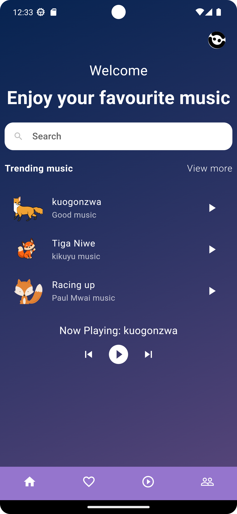
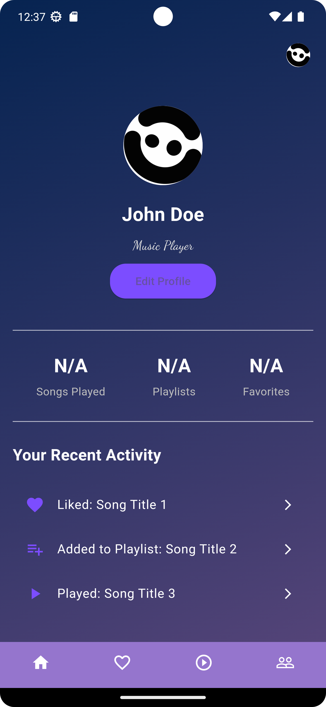
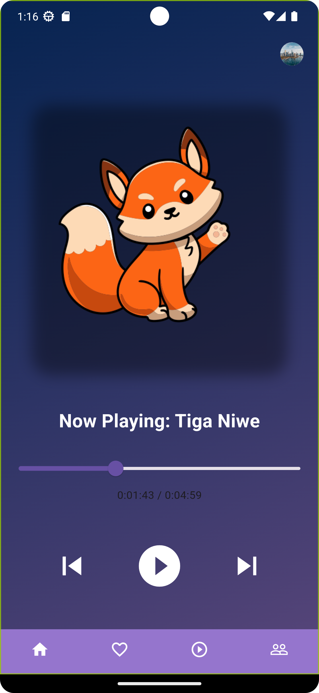

# Flutter Music Player App

This is a simple offline music player built using Flutter and Dart. The app allows users to play, pause, and seek through audio tracks stored on the device. It also includes navigation controls and displays song duration and progress.

## Features

- Play/pause offline music tracks from device storage.
- Seek through songs with a progress slider.
- Displays current position and total duration of the song.
- Simple, clean UI with navigation controls (next, previous, pause, play).
- Responsive design and scalable across different devices.

## Screenshots

<!-- Include images of your app's main screens here -->

## Getting Started

### Prerequisites

Ensure you have the following installed before running the project:

- Flutter SDK
- Dart SDK
- Android Studio or Xcode (for building the app on Android or iOS)
- A text editor such as Visual Studio Code

### Installation

1. **Clone the repository:**

   ```bash
   git clone https://github.com/your-username/flutter-music-player.git
   cd flutter-music-player




2. Install dependencies:

In the project directory, run the following command to install all dependencies:

```bash

flutter pub get
```
3. Run the app:

To launch the app on an emulator or a connected device, use the following command:

```bash

flutter run
